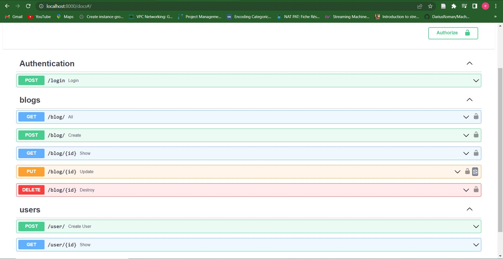
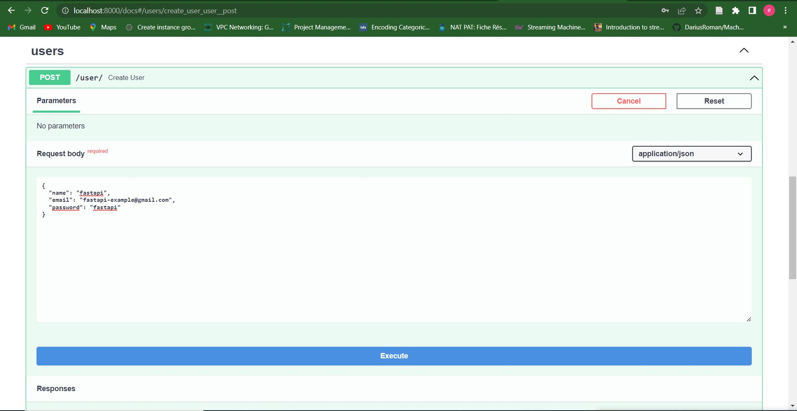
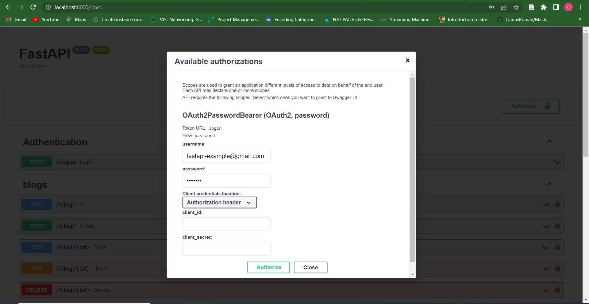
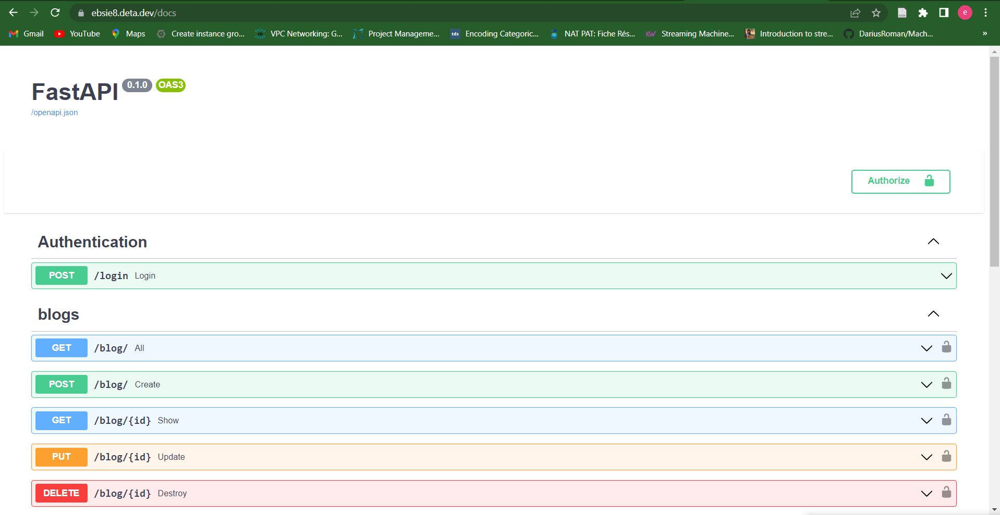

# FastAPI Project

In this project, we will create a full API for **CRUD** (Create Read Update Delete) of blog with user authentication.

## I- What is FastAPI?

[FastAPI](https://fastapi.tiangolo.com/) is a modern, fast(high-performance), web framework for building APIs with Python 3.7+ based on standard Python types hints. The key features are:

### 1- Automatic docs

#### 1.1- Swagger UI
Whenever you create an API, how are going to check that ? Generally we use a tool such as Postman. By default, FastAPI provides us a [Swagger UI](https://github.com/swagger-api/swagger-ui) (very nice UI that you can simply check what are the routes we are created, our API endpoints).

#### 1.2- ReDoc
FastAPI provides another automatic documentation provided by [ReDoc](https://github.com/Rebilly/ReDoc). This is the same but has a minimal design for the documentation.

### 2- Modern Framework

Since it is a modern framework, it also uses a modern features of Python. It uses Python 3.6 and more with type using Pydantic.

### 3- Based on open standards

- **JSON schema:**  By default, it returns JSON which every modern API needs to communicate with other things.
- **Open API** is a linux foundation, it defines how to create an API. It helps us create our APIs in a recommended way.

### 4- VsCode|PyCharm Editor support

Fast API has the auto completion in VSCode and PyCharm. This feature allows us to write APIs very fast.

### 5- Security and Authentication

- HTTP Basic
- OAuth2(also with JWT tokens)
- API keys in (headers, Query parameters, Cookies).

### 6- Dependency injection, Unlimited plug-ins, Testing

### 7- Starlette Features

Starlette is another framework of Python. Starlette provides:
- WebSocket support
- GraphQL support
- In-process background tasks
- Startup and shutdown events
- Test client built on requests
- CORS, GZip, Static Files, Streaming responses
- Session and Cookie support

### 8- Other Supports (SQL databases, NoSQL databases, GraphQL)

## II- Scope of the project

This project covers the following concepts:

### 1- Basic Concepts

- Path Parameters
- API Docs
- Query parameters
- Request body

### 2- Intermediate Concepts

- Pydantic Schemas
- SQLAlchemy database connection (used to connect to the database)
- Models and table (create a model and use that model to create a table in the database)

### 3- Database Tasks

- Store blog to database (We will use **SQLite**)
- Get blogs from database
- Delete
- Update

### 4- Responses

- Handling Exceptions
- Return response
- Define response model (so that we can only show certain fields which we only want). For example, if we don't want to show the password of the user, how can we restrict that?

### 5- User and Password

- Create user
- Hash user password (using the bcrypt algorithm)
- Show single user
- Define docs tags

### 6- Relationship

Since we are using SQLAlchemy, we will:

- Define User to Blog relationship
- Define Blog to User relationship

### 7- Refactoring

- API Router
- API Router with Parameter

### 8- Authentication using JWT

JWT stands for **JSON Web Token**, we will:

- Create Login route
- Login and verify password (using the hash algorithm)
- Return JWT access token
- Routes behind authentication

### 9- Deploy FastAPI
- We will deploy our API on the website [Deta.sh](https://www.deta.sh/?ref=fastapi)

## III- Instructions

### 1- Local Deployment

To run this project, follow the instructions below:

1. Clone this repository
```
git clone https://github.com/emoloic/FastAPI.git
```
2. Open the folder
```
cd FastAPI
```
3. Create a virtual environment and installation of the dependencies.

For this project, we will use [venv](https://docs.python.org/3/library/venv.html). `venv` is an environment manager that comes preinstalled with python3. Open your terminal and run the following commands:
- Create a virtual environment named `blog-env`
```bash
python -m venv blog-env
```
- Activate the virtual environment
```bash
source blog-env/Scripts/activate
```
- Install the dependencies
```bash
pip install -r requirements.txt
```
4. Run the server
```bash
cd blog
uvicorn main:app --reload
```
5. Open your browser at [http://localhost:8000/docs](http://localhost:8000/docs)

Once you open your browser at this address, you will see the automatic interactive API documentation (provided by Swagger UI)


Let's create a user. To create a user, simple go to the user route and use the POST method to register a new user. Click the button **Try it out**, then provide your informations (name, email and password) and click on the button **Execute**.


You need to be authenticated in order to have access to the API. To do that, simply go at the top of the page and click on the button **Authorize**. Once authenticated, you will be able to perform all the **CRUD** operation (ie Create, Read, Update, Delete). Simply go to each route and perform these operations.


We will only perform the first operations (ie Create a Blog). Feel free to try to perform the rest.

Go to the blogs route, and create a blog by using the `POST` method. You need to provide the body request `(title, body)` in a JSON format. Once the blog is created, the server will respond with a status code of 200 which means that the request has been successfully executed. 

## 2- Remote Deployment

In this section, we will use **Deta** to deploy our API on a remote server. There are a couple of things that need to be considered before deploying our application using [Deta](https://www.deta.sh/?ref=fastapi)

To deploy a FastAPI on Deta, our `main.py` and `requirements.txt` files must be at the same level in our directory. Since this is not our case, we have refactored our application in the directory [app](./app) to meet those reqquirements.

1. Enter to the app directory 
```bash
cd app
```
2. Create a free Deta account

To create a [free account on Deta](https://web.deta.sh/), you just need an email and password. You don't even need a credit card.
3. Install the CLI
Once you have your account, install the Deta CLI.
```bash
curl -fsSL https://get.deta.dev/cli.sh | sh
```
After installing it, open a new terminal so that the installed CLI is detected.

In a new terminal, confirm that it was correctly installed with:
```bash
deta --help
```
4. Login with the CLI

Now login to Deta from the CLI with:
```bash
deta login
``` 

This will open a new browser and authenticate automatically.
5. Deploy with Deta

Next, deploy our application with the Deta CLI:
```bash
deta new
```
You will see a JSON message similar to:
```javascript
{
        "name": "app",
        "id": "99955b74-29f8-41fd-8614-0a5ab896fb14",
        "project": "a0e3zshr",
        "runtime": "python3.9",
        "endpoint": "https://ebsie8.deta.dev",
        "region": "eu-central-1",
        "visor": "disabled",
        "http_auth": "disabled"
}
```
**Note:** Your deployment will have a different `"endpoint"` URL.

6. Check it

Now open your browser in your `endpoint` URL. In the example above it was `https://ebsie8.deta.dev`, but yours will be different.

You will see a JSON response from our FastAPI app:
```javascript
{"detail":"Not Found"}
```
And now go to the `/docs` for our API, in the example above it will be `https://ebsie8.deta.dev/docs`.

It will show your docs like:


You can now test our API in the same way we did when we were testing in our local machine.

## Improvements

Instead of using `SQLite` which is designed for quick experimentation. We can opt for a more robust database like MySQL, PostgreSQL, Oracle or SQL Server for deployment in production. Since this project is just a demo to show you how we can build a full API for CRUD operations with FastAPI, that's why we decided to choose a simple database like `SQLite`. 

For any problem, you can refer to the official documentation available [here](https://fastapi.tiangolo.com/)